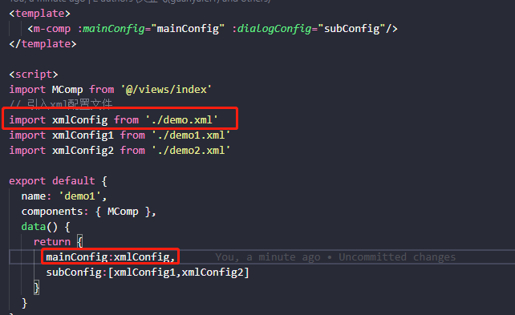
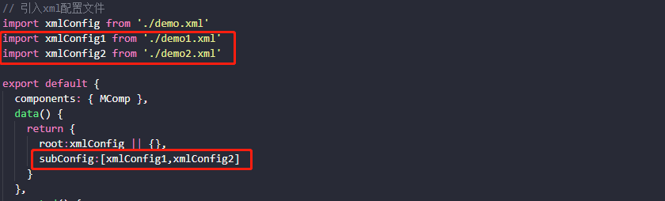
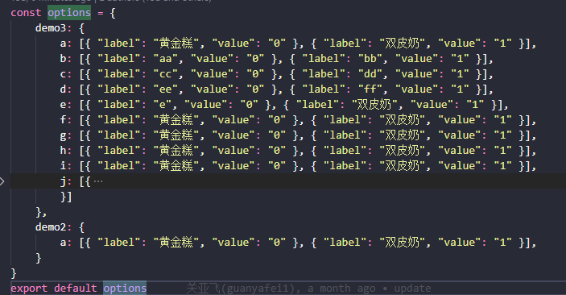

## 页面
> #### 一、目录
>> - 一级目录： src/views下建文件夹
>> - 二级目录： 一级目录下建文件夹
>>- 页面入口： 二级目录下index.vue
>> - xml配置文件： 入口文件同级
> #### 二、主副页面配置规则
>> - ##### 主页面
>>   \<root>\<main  _id="main">配置项\</main>\</root>
>> - ##### 副业面（弹窗）
>>   \<root>配置项\</root>
>> - **注**
>> 1.只能有一个主页面
>> 2.主页面只能有一个root和main标签
>> 3.副页面（弹窗）只能有一个root标签且不能有main标签
> ### 三、引入xml配置文件规则
>> - 主页面配置引入后赋值给root，无则空对象
>> 
>> - 弹窗配置引入后值添加到subConfig数组，无则空数组
>>  

## 标签配置
> ### 一、表单
>> - #### form
>>   \<form>\</form>  用于包裹formItem标签  
> ### 二、表单项
>> - #### formItem
>> | 参数 | 说明 | 类型 | 默认值 |
>> | :----: | :---  | :----: | :----: |
>> |  tag   | 输入框类型, 可选值为 cascader date daterange radio checkbox text zoom select textarea | string | - |
>> | lable  | 输入框左侧文本 | string | - |
>> | labelWidth  | 标签宽度 ，单位为 px| string | 100px |
>> | prop   | 当前输入框绑定的字段 | string | - |
>> | hidden | 是否隐藏 true隐藏  false显示| string | - |
>> | disabled | 是否禁用输入框 true是 false否 | string | - |
>> | required | 是否表单必填 true是 false否 | string | - |
>> | isDisabled | 是否禁用输入框 true是 false否 配合disabledId使用  详细dialog的disabledId说明 | string | - |
>>> - ##### tag可选值说明
>>>  **1. tag="text"**
>>> | 参数 | 说明 | 类型 | 默认值 |
>>> | :----: | :---  | :----: | :----: |
>>> |  text  | 文本框 | string | - |
>>> | validator | 校验 可选值在utils\/validate.js内setRules方法定义 例：tel、number、email  | string | - |
>>> | placeholder| 输入框占位提示文字 | string | 请输入 |
>>> | maxlength | 输入的最大字符数 | string | 50 |
>>> | width | 文本宽度，单位为 px | string | 200 |
>>>  **2. tag="textarea"**
>>> | 参数 | 说明 | 类型 | 默认值 |
>>> | :----: | :---  | :----: | :----: |
>>> |  textarea  | 文本域 | string | - |
>>> | maxlength | 输入的最大字符数 | string | 50 |
>>> | width | 文本宽度，单位为 px | string | 200 |
>>> | placeholder| 输入框占位提示文字 | string | 请输入 |
>>>  **3. tag="select"**
>>> | 参数 | 说明 | 类型 | 默认值 |
>>> | :----: | :---  | :----: | :----: |
>>> |  select  | 下拉框 | string | - |
>>> | placeholder| 输入框占位提示文字 | string | 请选择 |
>>> | width | 文本宽度，单位为 px | string | 200 |
>>> | optionId | 下拉选项id 获取配置的下拉项 详细见下方注释 | string | - |
>>> | action | 接口 获取下拉项 标签获取焦点时触发 optionId权重大于action | string | - |
>>> | method | 接口请求方式 配合action使用 | string | get |
>>>  **4. tag="radio"**
>>> | 参数 | 说明 | 类型 | 默认值 |
>>> | :----: | :---  | :----: | :----: |
>>> |  radio | 单选框 | string | - |
>>> | width | 文本宽度，单位为 px | string | auto |
>>> | optionId | 下拉选项id 获取配置的下拉项 详细见下方注释 | string | - |
>>>  **5. tag="checkbox"**
>>> | 参数 | 说明 | 类型 | 默认值 |
>>> | :----: | :---  | :----: | :----: |
>>> |  checkbox | 复选框 | string | - |
>>> | width | 文本宽度，单位为 px | string | auto |
>>> | optionId | 下拉选项id 获取配置的下拉项 详细见下方注释 | string | - |
>>>  **6. tag="date"**
>>> | 参数 | 说明 | 类型 | 默认值 |
>>> | :----: | :---  | :----: | :----: |
>>> |  date | 日期选择器 格式：年-月-日 | string | - |
>>> | placeholder| 输入框占位提示文字 | string | 选择日期 |
>>> | width | 文本宽度，单位为 px | string | 200 |
>>>  **7. tag="daterange"**
>>> | 参数 | 说明 | 类型 | 默认值 |
>>> | :----: | :---  | :----: | :----: |
>>> |  date | 日期时间选择器 格式：年-月-日 00:00:00 至  年-月-日 00:00:00 | string | - |
>>> | placeholder| 输入框占位提示文字 | string | 选择日期 |
>>> | width | 文本宽度，单位为 px | string | 250 |
>>>  **8. tag="cascader"**
>>> | 参数 | 说明 | 类型 | 默认值 |
>>> | :----: | :---  | :----: | :----: |
>>> | cascader | 级联选择器 | string | - |
>>> | placeholder| 输入框占位提示文字 | string | 请选择 |
>>> | action | 接口 获取下拉项 标签获取焦点时触发 optionId权重大于action | string | - |
>>> | method | 接口请求方式 配合action使用 | string | get |
>>> | lazyLoad | 是否进入页面自动加载数据 false true否 文本框获取焦点请求接口加载数据 | string | - |
>>> | width | 文本宽度，单位为 px | string | 200 |
>>>  **9. tag="zoom"**
>>> | 参数 | 说明 | 类型 | 默认值 |
>>> | :----: | :---  | :----: | :----: |
>>> | zoom | 放大镜 | string | - |
>>> | placeholder| 输入框占位提示文字 | string | 请选择 |
>>> | otherProps | 用于选中的一条数据多个字段赋值到多个表单项 ','隔开 例："codAccountNo?id,phone" 选中的数据的phone、codAccountNo字段值赋值到phone、codAccountNo表单项 若有'?' 如例子 表示选中的数据的id赋值给codAccountNo | string | - |
>>> | width | 文本宽度，单位为 px | string | 200 |
>>> | innerTextW | 放大镜弹窗内文本宽度，单位为 px | string | 200 |
>>> | zoomW | 放大镜弹窗宽度，单位为 px | string | 40% |
>>> | search | 查询功能表单项 '\|'隔开 例："客户账号,客户名称\|accountNo,company" | string | - |
>>> | hasReset | 是否有重置按钮 清除文本框内容 true是 false否 | string | - |
>>> | tableCol | table显示的数据项 表头项与每列绑定的值用'\|'隔开 例："客户账号,客户名称,电话\|accountNo,company,phone" | string | - |
>>> | action | 接口 获取放大镜数据  | string | - |
>>> | method | 接口请求方式 配合action使用 | string | get |
>>> | size | 每页显示条目个数 | string | 20 |
>>> | sizeList | 每页显示个数选择器的选项设置 | string | [20,30,40,50] |
>> - #### button
>>> | 参数 | 说明 | 类型 | 默认值 |
>>> | :----: | :---  | :----: | :----: |
>>> | type | 类型 不同类型展示样式不同| primary 、success、warning 、danger、info、text  | primary |
>>> | placeholder | 按钮文字 | string | - |
>>> | isQueryBtn | 是否是查询按钮 true是  false否 | string | - |
>>> | isQueryBtn | 是否是查询按钮 true是  false否 | string | - |
>>> | _id | 与需要操作的table、alert、dialog标签上定义的_id一致 用于指明需要操作的是哪个标签 **(注：若_id值为reset 则表示该按钮是重置按钮 用于清空查询表单项数据)**  | string | - |
> ### 四、表格
>> - #### table
>>> | 参数 | 说明 | 类型 | 默认值 |
>>> | :----: | :---  | :----: | :----: |
>>> |  _id | 值唯一 用途见button标签 | string | - |
>>> | action | 接口 获取表格数据  | string | - |
>>> | lazyLoad | 是否进入页面自动加载数据 true是 false否 需要手动点击查询按钮加载数据 | string | - |
>>> | method | 接口请求方式 配合action使用 | string | get |
>>> | size | 每页显示条目个数 | string | 20 |
>>> | sizeList | 每页显示个数选择器的选项设置 | string | [20,30,40,50] |
>> - #### tableCol 列
>>> | 参数 | 说明 | 类型 | 默认值 |
>>> | :----: | :---  | :----: | :----: |
>>> | lable  | 表头 | string | - |
>>> | prop   | table显示的数据项 表头项与每列绑定的值 操作栏则不需此值 | string | - |
>>> | align   | 对齐方式 left/center/right | string | center |
>>> | width   | 列宽度 单位px | string | auto（自适应） |
> ### 五、弹窗
>> - #### alert
>>> | 参数 | 说明 | 类型 | 默认值 |
>>> | :----: | :---  | :----: | :----: |
>>> |  _id | 值唯一 用途见button标签 **（注：两个button操作同一个alert，多个_id用'\|'隔开 ）**| string | - |
>>> | action | 弹窗确定按钮请求接口  **（注：两个button操作同一个alert，请求不同接口，action用'\|'隔开，多个action顺序与_id保持一致）** | string | - |
>>> | method | 接口请求方式 配合action使用 **（注：两个button操作同一个alert，请求不同接口，不同的请求方式，method用'\|'隔开，多个method顺序与_id保持一致）** | string | get |
>>> | tip | 提示语  **（注：两个button操作同一个alert，多个tip用'\|'隔开 多个tip顺序与_id保持一致）** | string | 此操作不可逆, 是否继续？ |
>> - #### dialog
>>> | 参数 | 说明 | 类型 | 默认值 |
>>> | :----: | :---  | :----: | :----: |
>>> |  _id | 值唯一 用途见button标签 **（注：两个button操作同一个dialog，多个_id用'\|'隔开 ）**| string | - |
>>> | width | 列宽度 单位px | string | 1000 |
>>> | action | 弹窗确定按钮请求接口  **（注：两个button操作同一个dialog，请求不同接口，action用'\|'隔开，多个action顺序与_id保持一致）** | string | - |
>>> | method | 接口请求方式 配合action使用 **（注：两个button操作同一个dialog，请求不同接口，不同的请求方式，method用'\|'隔开，多个method顺序与_id保持一致）** | string | get |
>>> | disabledId  | 两个button操作该弹窗时配合isDisabled使用  例：_id="add\|update" add、update按钮唤起同一个弹窗  需要update按钮唤起的弹窗里面一些表单字段置灰不可修改 设置disabledId为update formItem表单项设置isDisabled为true 则同一个表单项add内的可修改  update内的置灰| string | - |
>>> | saveOnShow | 点击保存后是否关闭弹窗  ture否  false是 **(注：若为true 保存成功后 保存按钮置灰不可点击）**| string | false |

## option配置
> - 配置文件位置：common/options.js
>  

