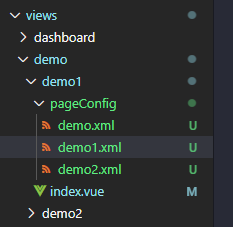
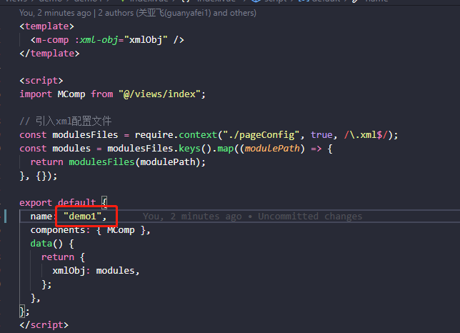
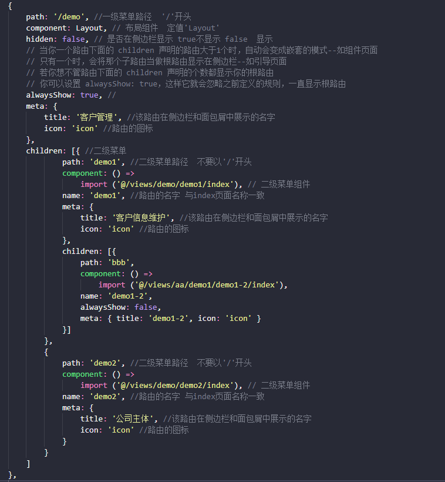
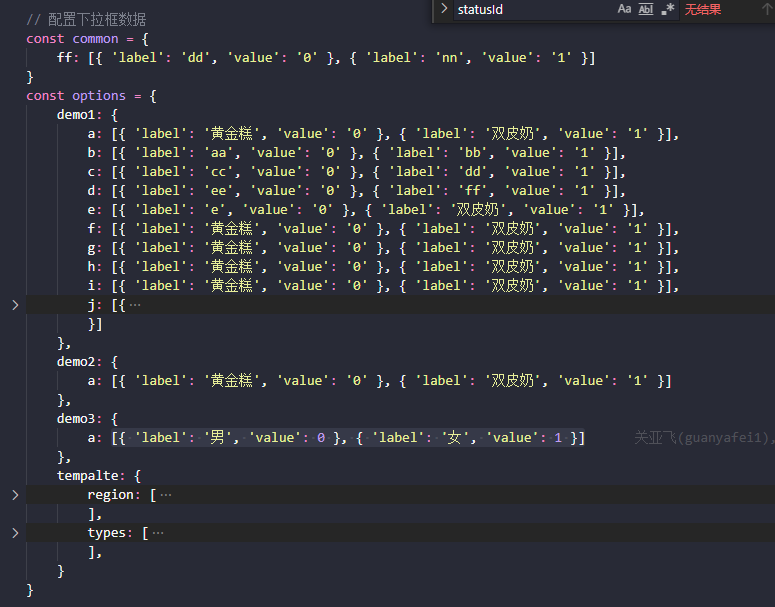

# Getting started
## 环境安装
> npm install -g vue-cli
## 依赖包安装
> npm i
## 运行
> npm run dev
## 打包
> npm run build:prod
## 页面结构

>├── build                      # 构建相关
├── mock                       # 项目mock 模拟数据
├── public                     # 静态资源
│   │── favicon.ico            # favicon图标
│   └── index.html             # html模板
├── src                        # 源代码
│   ├── api                    # 所有请求
│   ├── assets                 # 主题 图片等静态资源
│   ├── common                 # 公共配置
│   │   ├── options.js         # 下拉框公共配置
│   │   ├── status.js          # 按钮状态公共配置
│   │   ├── transForm.js       # 状态转描述公共配置
│   │   └── validate.js        # 自定义校验公共配置
│   ├── components             # 全局公用组件
│   ├── directive              # 全局指令
│   ├── filters                # 全局 filter
│   ├── icons                  # 项目所有 svg icons
│   ├── layout                 # 全局 layout
│   ├── router                 # 路由
│   ├── store                  # 全局 store管理
│   ├── styles                 # 全局样式
│   ├── utils                  # 全局公用方法
│   ├── views                  # views 所有页面
│   ├── App.vue                # 入口页面
│   ├── main.js                # 入口文件 加载组件 初始化等
│   └── permission.js          # 权限管理
├── .env.xxx                   # 环境变量配置
├── .eslintrc.js               # eslint 配置项
├── .babelrc                   # babel-loader 配置
├── vue.config.js              # vue-cli 配置
├── postcss.config.js          # postcss 配置
└── package.json               # package.json
## 新建页面
> #### 一、路径
>> - 一级路径： src/views下建文件夹
>> - 二级路径： 一级路径下建文件夹
>> - 入口文件： 二级路径下index.vue
>> - xml配置文件： 入口文件同级文件夹pageConfig下新建xml文件
>>  
> #### 二、主页面、弹窗配置规则
>> - ##### 主页面
>>   \<root>\<main  _id="main">配置项\</main>\</root>
>> - ##### 弹窗
>>   \<root>配置项\</root>
> #### **注意事项**
>> 1.只能有一个主页面 主页面、弹窗只能配置一个根标签root
>> 2.主页面只能配置一个root和main标签
>> 3.弹窗不能配置main标签
>> 4.主页面、弹窗root标签下可以设置多个弹窗配置 弹窗不可嵌套配置
>> 5.入口页面index.vue必须配置name字段 值与路由中配置的name值一致 且必须保证唯一性 
>>  

## 标签配置
> ### 一、表单
>> - #### form
>>   \<form>\</form>  用于包裹formItem标签  
> ### 二、表单项
>> - #### formItem
>> | 参数 | 说明 | 类型 | 默认值 |
>> | :----: | :---  | :----: | :----: |
>> |  tag   | 输入框类型, 可选值为 cascader date daterange radio checkbox text zoom select textarea | string | - |
>> | lable  | 输入框左侧文本 | string | - |
>> | labelWidth  | 标签宽度 ，单位为 px| string | - |
>> | prop   | 当前输入框绑定的字段 | string | - |
>> | hidden | 是否隐藏 true隐藏  false显示| string | - |
>> | block | 是否占一行 true是  false否| string | false |
>> | disabled | 是否置灰输入框 true是 false否 | string | false |
>> | required | 是否表单必填 true是 false否 | string | - |
>> | isDisabled | 是否禁用输入框 true是 false否 配合disabledId使用  详细dialog的disabledId说明 | string | - |
>>> - ##### tag可选值说明
>>>  **1. tag="text"**
>>> | 参数 | 说明 | 类型 | 默认值 |
>>> | :----: | :---  | :----: | :----: |
>>> |  text  | 文本框 | string | - |
>>> | validator | 校验 可选值在utils\/validate.js内setRules方法定义 例：tel、number、email  | string | - |
>>> | placeholder| 输入框占位提示文字 | string | 请输入 |
>>> | maxlength | 输入的最大字符数 | string | 200 |
>>> | width | 文本宽度，单位为 px | string | 250 |
>>>  **2. tag="textarea"**
>>> | 参数 | 说明 | 类型 | 默认值 |
>>> | :----: | :---  | :----: | :----: |
>>> |  textarea  | 文本域 | string | - |
>>> | maxlength | 输入的最大字符数 | string | 200 |
>>> | width | 文本宽度，单位为 px | string | 250 |
>>> | validator | 校验 可选值在utils\/validate.js内setRules方法定义 例：tel、number、email  | string | - |
>>> | placeholder| 输入框占位提示文字 | string | 请输入 |
>>> | rows| 输入框行数 | string | 1 |
>>>  **3. tag="select"**
>>> | 参数 | 说明 | 类型 | 默认值 |
>>> | :----: | :---  | :----: | :----: |
>>> |  select  | 下拉框 | string | - |
>>> | placeholder| 输入框占位提示文字 | string | 请选择 |
>>> | width | 文本宽度，单位为 px | string | 250 |
>>> | optionId | 下拉选项id 获取配置的下拉项 | string | - |
>>> | action | 接口 获取下拉项 标签获取焦点时触发 optionId权重大于action| string | - |
>>> | method | 接口请求方式 配合action使用 | string | get |
>>>  **4. tag="radio"**
>>> | 参数 | 说明 | 类型 | 默认值 |
>>> | :----: | :---  | :----: | :----: |
>>> |  radio | 单选框 | string | - |
>>> | width | 文本宽度，单位为 px | string | auto |
>>> | optionId | 下拉选项id 获取配置的下拉项 详细见下方option配置说明 | string | - |
>>>  **5. tag="checkbox"**
>>> | 参数 | 说明 | 类型 | 默认值 |
>>> | :----: | :---  | :----: | :----: |
>>> |  checkbox | 复选框 | string | - |
>>> | width | 文本宽度，单位为 px | string | auto |
>>> | optionId | 下拉选项id 获取配置的下拉项 详细见下方option配置说明  | string | - |
>>>  **6. tag="date"**
>>> | 参数 | 说明 | 类型 | 默认值 |
>>> | :----: | :---  | :----: | :----: |
>>> |  date | 日期选择器 格式：年-月-日 | string | - |
>>> | placeholder| 输入框占位提示文字 | string | 选择日期 |
>>> | width | 文本宽度，单位为 px | string | 250 |
>>>  **7. tag="daterange"**
>>> | 参数 | 说明 | 类型 | 默认值 |
>>> | :----: | :---  | :----: | :----: |
>>> |  date | 日期时间选择器 格式：年-月-日 00:00:00 至  年-月-日 00:00:00 | string | - |
>>> | placeholder| 输入框占位提示文字 | string | 选择日期 |
>>> | width | 文本宽度，单位为 px | string | 250 |
>>>  **8. tag="cascader"**
>>> | 参数 | 说明 | 类型 | 默认值 |
>>> | :----: | :---  | :----: | :----: |
>>> | cascader | 级联选择器 | string | - |
>>> | placeholder| 输入框占位提示文字 | string | 请选择 |
>>> | action | 接口 获取下拉项 标签获取焦点时触发 optionId权重大于action | string | - |
>>> | method | 接口请求方式 配合action使用 | string | get |
>>> | lazyLoad | 是否进入页面自动加载数据 false true否 文本框获取焦点请求接口加载数据 | string | - |
>>> | width | 文本宽度，单位为 px | string | 250 |
>>>  **9. tag="zoom"**
>>> | 参数 | 说明 | 类型 | 默认值 |
>>> | :----: | :---  | :----: | :----: |
>>> | zoom | 放大镜 | string | - |
>>> | placeholder| 输入框占位提示文字 | string | 请选择 |
>>> | otherProps | 用于选中的一条数据多个字段赋值到多个表单项 ','隔开 例："codAccountNo?id,phone" 选中的数据的phone、codAccountNo字段值赋值到phone、codAccountNo表单项 若有'?' 如例子 表示选中的数据的id赋值给codAccountNo | string | - |
>>> | width | 文本宽度，单位为 px | string | 250 |
>>> | title | 弹窗标题 | string | 提示 |
>>> | innerTextW | 放大镜弹窗内文本宽度，单位为 px | string | 250 |
>>> | zoomW | 放大镜弹窗宽度，单位为 px | string | 40% |
>>> | search | 查询功能表单项 '\|'隔开 例："客户账号,客户名称\|accountNo,company" | string | - |
>>> | hasReset | 是否有重置按钮 清除文本框内容 true是 false否 | string | - |
>>> | tableCol | table显示的数据项 表头项与每列绑定的值用'\|'隔开 例："客户账号,客户名称,电话\|accountNo,company,phone" | string | - |
>>> | action | 接口 获取放大镜数据  | string | - |
>>> | method | 接口请求方式 配合action使用 | string | get |
>>> | size | 每页显示条目个数 | string | 20 |
>>> | sizeList | 每页显示个数选择器的选项设置 | string | [20,30,40,50] |
>> - #### button
>>> | 参数 | 说明 | 类型 | 默认值 |
>>> | :----: | :---  | :----: | :----: |
>>> | type | 类型 不同类型展示样式不同| primary 、success、warning 、danger、info、text  | primary |
>>> | block | 是否占一行 true是  false否| string | false |
>>> | placeholder | 按钮文字 | string | - |
>>> | addToMore | 按钮是否加入更多下拉框内 true是 false否 | string | - |
>>> | disabled | 是否置灰按钮 true是 false否 | string | false |
>>> | isQueryBtn | 是否是查询按钮 true是  false否 | string | - |
>>> | statusId | 按钮状态校验id 用于表格操作按钮一些状态下置灰校验 **(注：statusId在common/status.js内配置 key值配置为需要校验的字段，value值数组配置哪些状态下置灰不可点击)** | string | - |
>>> | _id | 与需要操作的table、alert、dialog标签上定义的_id一致 用于指明需要操作的是哪个标签 **(注：若_id值为reset 则表示该按钮是重置按钮 用于清空查询表单项数据)**  | string | - |
> ### 四、表格
>> - #### table
>>> | 参数 | 说明 | 类型 | 默认值 |
>>> | :----: | :---  | :----: | :----: |
>>> |  _id | 值唯一 用途见button标签 | string | - |
>>> | action | 接口 获取表格数据  | string | - |
>>> | methodName | 接口 | string | - |
>>> | serviceName | 接口 | string | - |
>>> | lazyLoad | 是否进入页面自动加载数据 true是 false否 需要手动点击查询按钮加载数据 | string | - |
>>> | method | 接口请求方式 配合action使用 | string | get |
>>> | size | 每页显示条目个数 | string | 20 |
>>> | sizeList | 每页显示个数选择器的选项设置 | string | [20,30,40,50] |
>> - #### tableCol 列
>>> | 参数 | 说明 | 类型 | 默认值 |
>>> | :----: | :---  | :----: | :----: |
>>> | lable  | 表头 | string | - |
>>> | prop   | table显示的数据项 表头项与每列绑定的值 操作栏则不需此值 | string | - |
>>> | align   | 对齐方式 left/center/right | string | center |
>>> | width   | 列宽度 单位px | string | auto（自适应） |
> ### 五、弹窗
>> - #### alert
>>> | 参数 | 说明 | 类型 | 默认值 |
>>> | :----: | :---  | :----: | :----: |
>>> |  _id | 值唯一 用途见button标签 **（注：多个button操作同一个alert，_id用'\|'隔开 ）**| string | - |
>>> | action | 弹窗确定按钮请求接口  **（注：多个button操作同一个alert，请求不同接口，action用'\|'隔开，action顺序与_id保持一致）** | string | - |
>>> | method | 接口请求方式 配合action使用 **（注：多个button操作同一个alert，不同的请求方式，method用'\|'隔开，method顺序与_id保持一致）** | string | get |
>>> | tip | 提示语  **（注：多个button操作同一个alert，tip用'\|'隔开 tip顺序与_id保持一致）** | string | 此操作不可逆, 是否继续？ |
>> - #### dialog
>>> | 参数 | 说明 | 类型 | 默认值 |
>>> | :----: | :---  | :----: | :----: |
>>> |  _id | 值唯一 用途见button标签 **（注：多个button操作同一个dialog，_id用'\|'隔开 ）**| string | - |
>>> | title | 弹窗标题  **（注：多个button操作同一个dialog，_id用'\|'隔开 ）** | string | 提示 |
>>> | width | 列宽度 单位px | string | 1050 |
>>> | action | 弹窗确定按钮请求接口  **（注：多个button操作同一个dialog，请求不同接口，action用'\|'隔开，action顺序与_id保持一致）** | string | - |
>>> | method | 接口请求方式 配合action使用 **（注：多个button操作同一个dialog，不同的请求方式，method用'\|'隔开，method顺序与_id保持一致）** | string | get |
>>> | disabledId  | 两个button操作该弹窗时配合isDisabled使用  例：_id="add\|update" add、update按钮唤起同一个弹窗  需要update按钮唤起的弹窗里面一些表单字段置灰不可修改 设置disabledId为update formItem表单项设置isDisabled为true 则同一个表单项add内的可修改  update内的置灰| string | - |
>>> | saveOnShow | 点击保存后是否关闭弹窗  ture否  false是 | string | false |
## 路由格式
> | 参数 | 说明 | 类型 | 默认值 |
> | :----: | :---  | :----: | :----: |
> |  path | 菜单路径  一级菜单以'/'开头 二级菜单不用| string | - |
> | component | 组件 一级菜单下该值为定值"Layout" 二级菜单下该值为index页面路径 | string | - |
> | hidden | 是否在侧边栏显示 true不显示 false  显示 | string | false |
> | alwaysShow | // 一级二级路由设为true，若有三级  第三级设为false| string | - |
> | meta | 路由元信息 title：该路由在侧边栏和面包屑中展示的名字 icon：路由的图标 | string | - |
> | children | 子菜单项配置数组  配置说明同上 | string | - |
>  
## options配置
> 路径：conmmon/options.js
> - common：对象 公共配置 键：optionsId  值:数组对象  label：下拉展示描述 value：真实绑定的值
> - options: 对象 键：页面name值 值：对象(键：optionsId 值：数组对象  label：下拉展示描述 value：真实绑定的值)
>  

